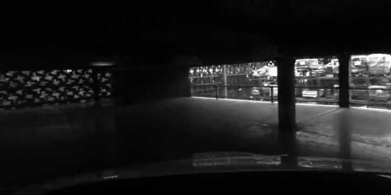
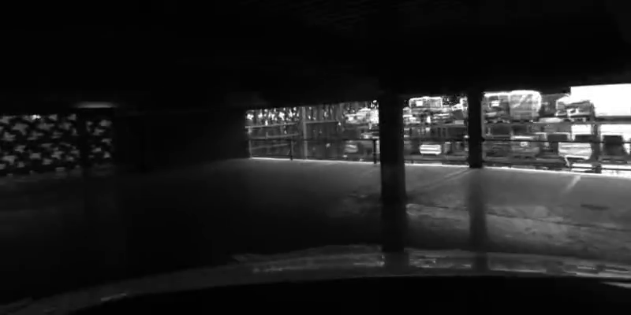

```{python}
#| include: false
import numpy as np
import matplotlib.pyplot as plt
from matplotlib.patches import FancyBboxPatch, Circle, FancyArrow, ConnectionPatch
import glob, re, os, json
from collections import defaultdict

plt.style.use('dark_background')
plt.rcParams.update({
    'figure.facecolor': '#191919', 'axes.facecolor': '#191919',
    'savefig.facecolor':'#191919', 'font.size': 11,
    'text.color': '#e0e0e0', 'axes.labelcolor': '#cccccc',
    'axes.edgecolor': '#555555', 'xtick.color': '#999999', 'ytick.color': '#999999',
})

def q_to_R(qx, qy, qz, qw):
    return np.array([
        [1-2*qy**2-2*qz**2, 2*qx*qy-2*qz*qw, 2*qx*qz+2*qy*qw],
        [2*qx*qy+2*qz*qw, 1-2*qx**2-2*qz**2, 2*qy*qz-2*qx*qw],
        [2*qx*qz-2*qy*qw, 2*qy*qz+2*qx*qw, 1-2*qx**2-2*qy**2]
    ])

def parse_keyframe(file_path):
    with open(file_path, 'r') as f:
        content = f.read()
    ts_match = re.search(r'^(\d+)$', content, re.MULTILINE)
    timestamp = int(ts_match.group(1)) if ts_match else 0
    intr_match = re.search(r'# fx, fy, cx, cy, .*\n([\d\.,\- ]+)', content)
    fx = fy = 500.0; cx = 400.0; cy = 200.0; img_w = 800; img_h = 400
    if intr_match:
        vals = list(map(float, intr_match.group(1).split(',')))
        fx, fy, cx, cy = vals[:4]
        if len(vals) >= 6:
            img_w, img_h = int(vals[4]), int(vals[5])
    ctw_match = re.search(r'# camToWorld: .*\n([\d\.,\- ]+)', content)
    if not ctw_match: return None
    vals = list(map(float, ctw_match.group(1).split(',')))
    t = np.array(vals[:3]); qx, qy, qz, qw = vals[3:]
    R = q_to_R(qx, qy, qz, qw)
    data_part = content.split('Point Cloud Data :')[1].strip()
    lines = [l for l in data_part.split('\n') if l and not l.startswith('#')]
    pts = []
    pixels = []  # (u, v, grayscale) für Bild-Rekonstruktion
    for i in range(0, len(lines)-1, 2):
        try:
            coords = list(map(float, lines[i].split(',')))
            u, v, idepth = coords[0], coords[1], coords[2]
            if idepth <= 0: continue
            color_vals = list(map(int, lines[i+1].strip(',').split(',')))
            avg_gray = sum(color_vals) / len(color_vals)
            pixels.append((int(u), int(v), avg_gray / 255.0))
            depth = 1.0/idepth
            P_w = R @ np.array([(u-cx)*depth/fx, (v-cy)*depth/fy, depth]) + t
            pts.append(P_w)
        except: continue
    return {'timestamp':timestamp, 't':t, 'R':R, 'q':np.array([qx,qy,qz,qw]),
            'fx':fx,'fy':fy,'cx':cx,'cy':cy, 'w':img_w, 'h':img_h,
            'points_3d':np.array(pts) if pts else np.zeros((0,3)),
            'pixels': pixels}

# Sample jeden 5. KeyFrame für Performanz
KF_DIR = "data/vc_feature_points/KeyFrameData"
kf_files = sorted(glob.glob(os.path.join(KF_DIR, "KeyFrame_*.txt")))
STEP = 5
keyframes = []
for f in kf_files[::STEP]:
    kf = parse_keyframe(f)
    if kf is not None and len(kf['points_3d']) > 10:
        keyframes.append(kf)
n = len(keyframes)
traj = np.array([kf['t'] for kf in keyframes])

# Ground Truth
GT_FILE = "data/vc_ref_poses/GNSSPoses.txt"
gt_poses = []
with open(GT_FILE) as f:
    for line in f:
        if line.startswith('#') or not line.strip(): continue
        p = line.strip().split(',')
        if len(p) < 8: continue
        gt_poses.append({'timestamp':int(p[0]), 't':np.array([float(x) for x in p[1:4]])})
kf_ts = np.array([kf['timestamp'] for kf in keyframes])
gt_ts = np.array([g['timestamp'] for g in gt_poses])
gt_traj = np.array([gt_poses[np.argmin(np.abs(gt_ts-ts))]['t'] for ts in kf_ts])
drift = np.linalg.norm(traj - gt_traj, axis=1)

print(f"KeyFrames geladen: {n} (jeder {STEP}.)")
print(f"Pfadlänge: {np.sum(np.linalg.norm(np.diff(traj,axis=0),axis=1)):.1f} m")
print(f"Drift: mean={np.mean(drift):.2f}m, max={np.max(drift):.2f}m")
```

## Agenda

1. Warum Loop Closure? — Das Drift-Problem
2. **Schritt 1:** Trajektorie analysieren — Wo könnte ein Loop sein?
3. **Schritt 2:** Place Recognition — Bag of Visual Words
4. **Schritt 3:** Similarity-Matrix & Loop Candidates
5. **Schritt 4:** Geometrische Verifikation
6. **Ergebnis:** Verifizierte Loop-Closure-Kanten

::: {.callout-important}
**Anknüpfung an 2.2:** Nach der lokalen Optimierung (Bundle Adjustment) haben wir eine
konsistente **lokale** Karte. Aber über lange Distanzen akkumuliert sich Drift —
das System „vergisst", wo es schon war. Loop Closure erkennt die Wiederkehr
an einen bekannten Ort und liefert die Constraints für die globale Korrektur in 3.2.
:::

## Problem: Drift über lange Trajektorien

```{python}
#| output: true
#| fig-width: 10
#| fig-height: 6
#| label: fig-trajectory-drift
#| fig-cap: "Kameratrajektorie mit sichtbarem Drift vs. Ground Truth"

fig, axes = plt.subplots(1, 2, figsize=(14, 5.5))

ax = axes[0]
ax.plot(traj[:, 0], traj[:, 2], '.-', color='#3498db', linewidth=0.8, markersize=2, label='Geschätzt (VO)')
ax.plot(gt_traj[:, 0], gt_traj[:, 2], '--', color='#e74c3c', linewidth=1.0, label='Ground Truth (GNSS)')
ax.scatter(traj[0,0], traj[0,2], color='#2ecc71', s=80, zorder=5, marker='o', label='Start')
ax.scatter(traj[-1,0], traj[-1,2], color='#f39c12', s=80, zorder=5, marker='s', label='Ende')
ax.set_xlabel('X (m)'); ax.set_ylabel('Z (m)')
ax.set_title('Draufsicht (X–Z)')
ax.legend(fontsize=8, loc='upper left')
ax.set_aspect('equal'); ax.grid(True, alpha=0.3)

ax = axes[1]
frame_idx = np.arange(n)
ax.fill_between(frame_idx, 0, drift, color='#e74c3c', alpha=0.3)
ax.plot(frame_idx, drift, color='#e74c3c', linewidth=1.5)
z = np.polyfit(frame_idx, drift, 1)
ax.plot(frame_idx, np.poly1d(z)(frame_idx), '--', color='#f39c12', linewidth=1.0, alpha=0.7,
        label=f'Trend: ~{z[0]*100:.1f} cm/KF')
ax.set_xlabel('KeyFrame-Index'); ax.set_ylabel('Absoluter Positionsfehler (m)')
ax.set_title('Drift über die Trajektorie')
ax.grid(True, alpha=0.3); ax.legend(fontsize=8)
plt.tight_layout(); plt.show()
```

::: {.callout-note}
Der Drift wächst mit der zurückgelegten Distanz kontinuierlich an. Nach dem gesamten
Pfad beträgt der absolute Fehler mehrere Meter. Ohne Loop Closure würde die Karte
immer weiter auseinanderlaufen.
:::

## Schritt 1: Wo sind die Loop-Kandidaten?

Bevor aufwändige Bildvergleiche stattfinden, identifizieren wir räumliche Nähe:
Zwei KeyFrames, die **nah im Raum** aber **weit in der Zeit** auseinanderliegen.

```{python}
#| output: true
#| fig-width: 10
#| fig-height: 7
#| label: fig-spatial-loops
#| fig-cap: "Räumliche Distanzmatrix und Loop-Kandidaten"

# Euklidische Distanzmatrix
D = np.zeros((n, n))
for i in range(n):
    D[i] = np.linalg.norm(traj - traj[i], axis=1)

SPATIAL_THRESH = 1.5    # Meter
TEMPORAL_THRESH = 20     # KeyFrames (zeitlicher Mindestabstand)

loop_mask = (D < SPATIAL_THRESH) & (np.abs(np.arange(n)[:,None]-np.arange(n)[None,:]) > TEMPORAL_THRESH)
raw_pairs = np.argwhere(loop_mask)

# Ein Cluster pro zeitlichem Block
used_j = set()
spatial_candidates = []
for i, j in raw_pairs:
    if i < j and j not in used_j:
        spatial_candidates.append((i, j))
        used_j.add(j)

print(f"Räumliche Loop-Kandidaten (roh): {len(raw_pairs)}")
print(f"Davon gefiltert (einer pro Cluster): {len(spatial_candidates)}")
for i, j in spatial_candidates[:8]:
    print(f"  KF {i:3d} ↔ KF {j:3d}  |  Dist: {D[i,j]:.2f} m  |  Δt: {j-i} Frames")

fig, axes = plt.subplots(1, 2, figsize=(14, 5.5))
ax = axes[0]
im = ax.imshow(np.log1p(D), cmap='inferno', aspect='auto')
ax.set_xlabel('KeyFrame j'); ax.set_ylabel('KeyFrame i')
ax.set_title('log(1 + Distanzmatrix)')
plt.colorbar(im, ax=ax, label='log(1+m)', shrink=0.8)
ax = axes[1]
ax.plot(traj[:,0], traj[:,2], '.-', color='#3498db', linewidth=0.6, markersize=1.5, alpha=0.7)
ax.scatter(traj[0,0], traj[0,2], color='#2ecc71', s=60, zorder=5, marker='o', label='Start')
for i, j in spatial_candidates:
    ax.plot([traj[i,0],traj[j,0]], [traj[i,2],traj[j,2]], color='#e74c3c', linewidth=0.8, alpha=0.5)
ax.set_xlabel('X (m)'); ax.set_ylabel('Z (m)')
ax.set_title(f'Loop-Kandidaten (räumlich, {len(spatial_candidates)} Paare)')
ax.set_aspect('equal'); ax.grid(True, alpha=0.3); ax.legend(fontsize=8)
plt.tight_layout(); plt.show()
```

## Schritt 2: Place Recognition — Bag of Visual Words

In einem realen ORB-SLAM3-System werden ORB-Deskriptoren aus den Bildern extrahiert
und über k-Means zu einem visuellen Wörterbuch geclustert. Wir verwenden die räumliche
Verteilung der 3D-Punkte als Proxy — das Prinzip ist dasselbe.

```{python}
#| output: true
#| fig-width: 12
#| fig-height: 5
#| label: fig-bow
#| fig-cap: "Bag of Visual Words — Vokabular aus 3D-Punkt-Merkmalen"

all_pts = np.vstack([kf['points_3d'] for kf in keyframes])
K = 50  # Vokabulargröße
rng = np.random.RandomState(42)
sample_idx = rng.choice(len(all_pts), min(3000, len(all_pts)), replace=False)
samples = all_pts[sample_idx]

# k-Means++ Initialisierung
centers = [samples[rng.randint(len(samples))]]
for _ in range(1, K):
    dists = np.min([np.linalg.norm(samples-c,axis=1) for c in centers], axis=0)
    centers.append(samples[rng.choice(len(samples), p=dists**2/np.sum(dists**2))])
centers = np.array(centers)

for it in range(20):
    labels = np.argmin(np.linalg.norm(samples[:,None,:]-centers[None,:,:],axis=2), axis=1)
    new_c = np.array([samples[labels==k].mean(0) if np.any(labels==k) else centers[k] for k in range(K)])
    if np.linalg.norm(new_c-centers) < 1e-4: break
    centers = new_c
print(f"Vokabular: {K} visuelle Wörter ({it+1} Iterationen)")

def compute_bow(pts, centers):
    if len(pts) == 0: return np.zeros(len(centers))
    labs = np.argmin(np.linalg.norm(pts[:,None,:]-centers[None,:,:],axis=2), axis=1)
    hist, _ = np.histogram(labs, bins=np.arange(K+1), density=True)
    return hist

bow_vectors = np.array([compute_bow(kf['points_3d'], centers) for kf in keyframes])

def chi2(h1, h2):
    eps = 1e-10
    return 0.5*np.sum((h1-h2)**2/(h1+h2+eps))

S = np.zeros((n,n))
for i in range(n):
    for j in range(i+1,n):
        d = chi2(bow_vectors[i], bow_vectors[j])
        S[i,j] = S[j,i] = d
S_norm = S/(np.max(S)+1e-10)

fig, axes = plt.subplots(1, 3, figsize=(16, 4.5))
ax = axes[0]
ax.scatter(all_pts[::50,0], all_pts[::50,2], c='#555555', s=0.3, alpha=0.3)
ax.scatter(centers[:,0], centers[:,2], c='#e74c3c', s=30, marker='*', zorder=5)
ax.set_xlabel('X (m)'); ax.set_ylabel('Z (m)')
ax.set_title(f'Vokabular: {K} Zentren'); ax.set_aspect('equal'); ax.grid(True, alpha=0.3)

ax = axes[1]
ka, kb = 10, 60
ax.bar(np.arange(K)-0.2, bow_vectors[ka], width=0.4, color='#3498db', alpha=0.8, label=f'KF {ka}')
ax.bar(np.arange(K)+0.2, bow_vectors[kb], width=0.4, color='#e74c3c', alpha=0.8, label=f'KF {kb}')
ax.set_xlabel('Visuelles Wort'); ax.set_ylabel('Häufigkeit (norm.)')
ax.set_title(f'BoW: KF{ka} vs KF{kb}  χ²={S[ka,kb]:.3f}'); ax.legend(fontsize=8)

ax = axes[2]
im = ax.imshow(1.0-S_norm, cmap='viridis', aspect='auto')
ax.set_xlabel('KeyFrame j'); ax.set_ylabel('KeyFrame i')
ax.set_title('BoW-Ähnlichkeit (1−χ²)')
plt.colorbar(im, ax=ax, label='Ähnlichkeit', shrink=0.8)
plt.tight_layout(); plt.show()
```

## Schritt 3: Kombiniertes Scoring & Loop-Selektion

```{python}
#| output: true
#| fig-width: 10
#| fig-height: 5
#| label: fig-loop-selection
#| fig-cap: "Beste Loop-Kandidaten via kombiniertem BoW + räumlichem Scoring"

# Score = BoW-Ähnlichkeit × räumliche Nähe
time_mask = np.abs(np.arange(n)[:,None]-np.arange(n)[None,:]) > TEMPORAL_THRESH
D_max = np.max(D[D<100])
D_norm = np.clip(D, 0.1, D_max)/D_max
combined = (1.0-S_norm)*(1.0/(D_norm+0.01))
combined[~time_mask] = 0
np.fill_diagonal(combined, 0)

TOP_K = 8
idx = np.dstack(np.unravel_index(np.argsort(-combined.ravel()), combined.shape))[0]
idx = idx[idx[:,0] < idx[:,1]]
best_candidates = idx[:TOP_K]

print(f"Top {TOP_K} Loop-Kandidaten (BoW + räumliche Nähe):")
for rank, (i, j) in enumerate(best_candidates):
    print(f"  #{rank+1}: KF{i:3d}↔KF{j:3d}  BoW-Sim={1-S_norm[i,j]:.3f}  Dist={D[i,j]:.2f}m  Score={combined[i,j]:.0f}")

fig, ax = plt.subplots(1, 1, figsize=(12, 7))
ax.plot(traj[:,0], traj[:,2], '.-', color='#3498db', linewidth=0.6, markersize=1.5, alpha=0.5)
ax.scatter(traj[0,0], traj[0,2], color='#2ecc71', s=80, zorder=5, marker='o', label='Start')
for rank, (i, j) in enumerate(best_candidates):
    alpha = 0.9 - rank*0.08
    ax.plot([traj[i,0],traj[j,0]], [traj[i,2],traj[j,2]], color='#e74c3c',
            linewidth=2.0-rank*0.15, alpha=alpha, label=f'#{rank+1}: KF{i}↔KF{j}' if rank<5 else '')
    ax.scatter(traj[i,0], traj[i,2], color='#f39c12', s=30, zorder=4)
    ax.scatter(traj[j,0], traj[j,2], color='#e74c3c', s=30, zorder=4, marker='D')
ax.set_xlabel('X (m)'); ax.set_ylabel('Z (m)')
ax.set_title(f'Top {TOP_K} Loop-Kandidaten'); ax.set_aspect('equal')
ax.grid(True, alpha=0.3); ax.legend(fontsize=7, loc='upper left', ncol=2)
plt.tight_layout(); plt.show()
```

## Schritt 4: Geometrische Verifikation

Jeder Kandidat wird geometrisch geprüft: Wie viele 3D-Punkte beider Frames liegen
in derselben Weltregion? Eine hohe Überlappung bestätigt den Loop.

```{python}
#| output: true
#| fig-width: 12
#| fig-height: 6
#| label: fig-geometric-verification
#| fig-cap: "Geometrische Verifikation der Loop-Kandidaten"

def geometric_check(kf_i, kf_j, thresh=0.5):
    if len(kf_i['points_3d'])<20 or len(kf_j['points_3d'])<20:
        return 0.0, 0
    dists = np.linalg.norm(kf_i['points_3d'][:,None,:]-kf_j['points_3d'][None,:,:], axis=2)
    n_inliers = np.sum(np.min(dists, axis=1) < thresh)
    return n_inliers/len(kf_i['points_3d']), n_inliers

print("Geometrische Verifikation:\n")
print(f"{'Rank':<6}{'Paar':<14}{'Inlier-Ratio':<14}{'Inliers':<10}{'Verifiziert?':<15}")
print("-"*60)

verified_loops = []
for rank, (i, j) in enumerate(best_candidates):
    ratio, ninl = geometric_check(keyframes[i], keyframes[j])
    ok = ratio > 0.10
    print(f"#{rank+1:<5} KF{i:3d}↔KF{j:3d}  {ratio:.3f}        {ninl:<10} {'✓ JA' if ok else '✗ nein'}")
    if ok:
        verified_loops.append((int(i), int(j), float(ratio), int(ninl)))

print(f"\nVerifiziert: {len(verified_loops)}/{len(best_candidates)}")

# Detail-Visualisierung des besten verifizierten Loops
if verified_loops:
    di, dj, dr, dn = verified_loops[0]
    fig, axes = plt.subplots(1, 2, figsize=(14, 5.5))
    ax = axes[0]
    pi, pj = keyframes[di]['points_3d'], keyframes[dj]['points_3d']
    ax.scatter(pi[::5,0], pi[::5,2], c='#3498db', s=2, alpha=0.5, label=f'KF {di}')
    ax.scatter(pj[::5,0], pj[::5,2], c='#e74c3c', s=8, alpha=0.7, marker='x', label=f'KF {dj}')
    ax.set_xlabel('X (m)'); ax.set_ylabel('Z (m)')
    ax.set_title(f'3D-Punkt-Überlappung: KF{di}↔KF{dj} (Ratio: {dr:.2f})')
    ax.set_aspect('equal'); ax.grid(True, alpha=0.3); ax.legend(fontsize=8)

    ax = axes[1]
    ax.plot(traj[:,0], traj[:,2], '.-', color='#3498db', linewidth=0.5, markersize=1, alpha=0.4)
    ax.scatter(traj[0,0], traj[0,2], color='#2ecc71', s=60, zorder=5, marker='o', label='Start')
    for i, j, ratio, _ in verified_loops:
        alpha = 0.2+0.6*ratio
        ax.plot([traj[i,0],traj[j,0]],[traj[i,2],traj[j,2]], color='#2ecc71', linewidth=1.5*ratio, alpha=alpha)
        ax.scatter(traj[i,0],traj[i,2], color='#f39c12', s=25, zorder=3, alpha=alpha)
        ax.scatter(traj[j,0],traj[j,2], color='#e74c3c', s=25, zorder=3, alpha=alpha)
    ax.set_xlabel('X (m)'); ax.set_ylabel('Z (m)')
    ax.set_title(f'{len(verified_loops)} verifizierte Loop Closures')
    ax.set_aspect('equal'); ax.grid(True, alpha=0.3); ax.legend(fontsize=8)
    plt.tight_layout(); plt.show()
```

## Konkretes Beispiel: Loop Closure mit echten Kameradaten

Der am höchsten bewertete Loop (#1) ist **KF255 ↔ KF294** mit 40% Punkt-Überlappung.
Hier sehen wir die tatsächlichen Kamerabilder — Frames, die per ffmpeg an der
passenden Zeitposition aus dem Video extrahiert wurden.

```{python}
#| output: true
#| fig-width: 16
#| fig-height: 9
#| label: fig-concrete-example
#| fig-cap: "Konkretes Loop-Closure-Beispiel mit rekonstruierten Kamerabildern"

# Bestes Beispiel = der #1-Kandidat (höchster kombinierter Score), der die Verifikation besteht
best_pair = verified_loops[0]

bi, bj, bratio, bninl = best_pair
print(f"Bester Loop: KF{bi} ↔ KF{bj}")
print(f"  Überlappung: {bratio*100:.0f}%")
print(f"  Gemeinsame 3D-Punkte: {bninl}")
print(f"  Räumliche Distanz: {np.linalg.norm(traj[bi]-traj[bj]):.2f} m")
print(f"  Zeitlicher Abstand: {(bj-bi)*STEP} Original-Frames")

kf_i = keyframes[bi]; kf_j = keyframes[bj]
print(f"KF{bi}: {len(kf_i['pixels'])} sichtbare Punkte, {kf_i['w']}×{kf_i['h']}")
print(f"KF{bj}: {len(kf_j['pixels'])} sichtbare Punkte, {kf_j['w']}×{kf_j['h']}")

# Echte Kamerabilder wurden aus dem Video extrahiert (ffmpeg)
# Sie liegen unter images/loop_frames/

# Visualisierung mit echten Kamerabildern
fig = plt.figure(figsize=(18, 11))

# Trajektorie mit Loop-Highlight
ax1 = fig.add_subplot(2, 3, (1, 2))
ax1.plot(traj[:,0], traj[:,2], '.-', color='#3498db', lw=0.4, ms=0.8, alpha=0.5)
ax1.scatter(traj[0,0], traj[0,2], color='#2ecc71', s=60, zorder=5, marker='o', label='Start')
ax1.plot([traj[bi,0],traj[bj,0]], [traj[bi,2],traj[bj,2]], color='#e74c3c', lw=2.5, alpha=0.9)
ax1.scatter(traj[bi,0], traj[bi,2], color='#f39c12', s=100, zorder=5, marker='o', label=f'KF {bi}')
ax1.scatter(traj[bj,0], traj[bj,2], color='#e74c3c', s=100, zorder=5, marker='D', label=f'KF {bj}')
ax1.set_xlabel('X (m)'); ax1.set_ylabel('Z (m)')
ax1.set_title(f'Loop Closure: KF{bi} ↔ KF{bj} — {(bj-bi)*STEP} Frames Abstand')
ax1.set_aspect('equal'); ax1.grid(True, alpha=0.3); ax1.legend(fontsize=8)

# 3D-Punktwolken-Überlappung
pi = kf_i['points_3d']; pj = kf_j['points_3d']
ax5 = fig.add_subplot(2, 3, 3)
ax5.scatter(pi[::3,0], pi[::3,2], c='#f39c12', s=1.5, alpha=0.6, label=f'KF {bi}')
ax5.scatter(pj[::3,0], pj[::3,2], c='#e74c3c', s=4, alpha=0.7, marker='x', label=f'KF {bj}')
ax5.set_xlabel('X (m)'); ax5.set_ylabel('Z (m)')
ax5.set_title(f'3D-Punktwolken im Welt-KS\n{bratio*100:.0f}% Überlappung ({bninl} Punkte)')
ax5.set_aspect('equal'); ax5.grid(True, alpha=0.3); ax5.legend(fontsize=8, markerscale=2)

# Platzhalter für die echten Kamerabilder (werden als Markdown-Bilder eingefügt)
ax2 = fig.add_subplot(2, 3, 4)
ax2.text(0.5, 0.5, '← Siehe Kamerabilder unten →', ha='center', va='center',
         transform=ax2.transAxes, fontsize=12, color='#888888')
ax2.axis('off')
ax2.set_title(f'Echte Kamerabilder: KF {bi} & KF {bj}')

ax4 = fig.add_subplot(2, 3, (5, 6))
ax4.plot(traj[max(0,bi-30):min(n,bj+30),0], traj[max(0,bi-30):min(n,bj+30),2],
         '-', color='#555555', lw=1.5, alpha=0.3)
ax4.plot(traj[bi:bj+1,0], traj[bi:bj+1,2], '.-', color='#3498db', lw=1.2, ms=3)
ax4.scatter(traj[bi,0], traj[bi,2], color='#f39c12', s=120, zorder=5, marker='o', label=f'KF {bi}')
ax4.scatter(traj[bj,0], traj[bj,2], color='#e74c3c', s=120, zorder=5, marker='D', label=f'KF {bj}')
ax4.set_xlabel('X (m)'); ax4.set_ylabel('Z (m)')
ax4.set_title(f'Trajektorien-Ausschnitt: Frames {bi*STEP}–{bj*STEP}')
ax4.set_aspect('equal'); ax4.grid(True, alpha=0.3); ax4.legend(fontsize=8)

plt.tight_layout(); plt.show()
```

::: {layout-ncol=2}

{width=100%}

{width=100%}

:::

::: {.callout-tip}
**Die Kamera hat den Ort wiedererkannt** — nicht durch GPS, sondern rein visuell.
Vergleiche die Strukturen in beiden Bildern: dieselbe Umgebung aus leicht
verschobener Perspektive. Die 3D-Punktwolken bestätigen geometrisch, dass es
sich um denselben Ort handelt. Diese Loop-Closure-Kante geht als Constraint
in die globale Optimierung (3.2) ein.

## Ergebnis: Loop-Closure Constraints für 3.2

```{python}
#| output: true
#| fig-width: 10
#| fig-height: 5
#| label: fig-final-loops
#| fig-cap: "Finale Loop-Closure-Kanten für die Pose-Graph-Optimierung"

print("="*60)
print("ZUSAMMENFASSUNG — Loop Closure Detection")
print("="*60)
print(f"KeyFrames:           {n}")
print(f"Pfadlänge:           {np.sum(np.linalg.norm(np.diff(traj,axis=0),axis=1)):.1f} m")
print(f"Max. Drift:          {np.max(drift):.2f} m")
print(f"Räumliche Kandidaten: {len(spatial_candidates)}")
print(f"Verifizierte Loops:   {len(verified_loops)}")
print()
print("→ Diese Constraints fließen in die Pose-Graph-Optimierung (3.2) ein.")
print("="*60)

# Speichere Loop-Constraints für Notebook 3.2
loop_data = {'pairs': [(i, j, ratio) for i, j, ratio, _ in verified_loops],
             'n_keyframes': n, 'trajectory': traj.tolist()}
with open('loop_constraints.json', 'w') as f:
    json.dump(loop_data, f, indent=2)
print("\n✓ loop_constraints.json gespeichert")
```
