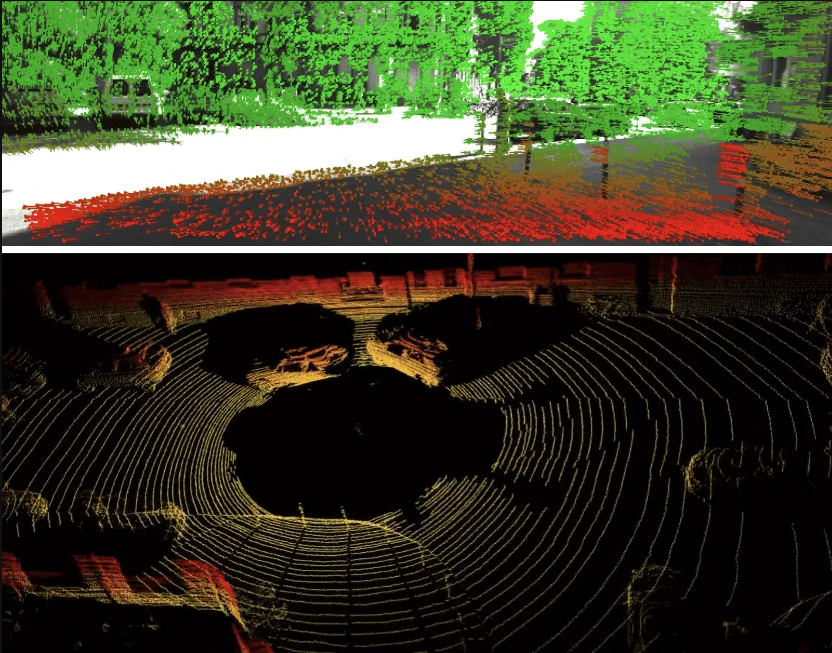
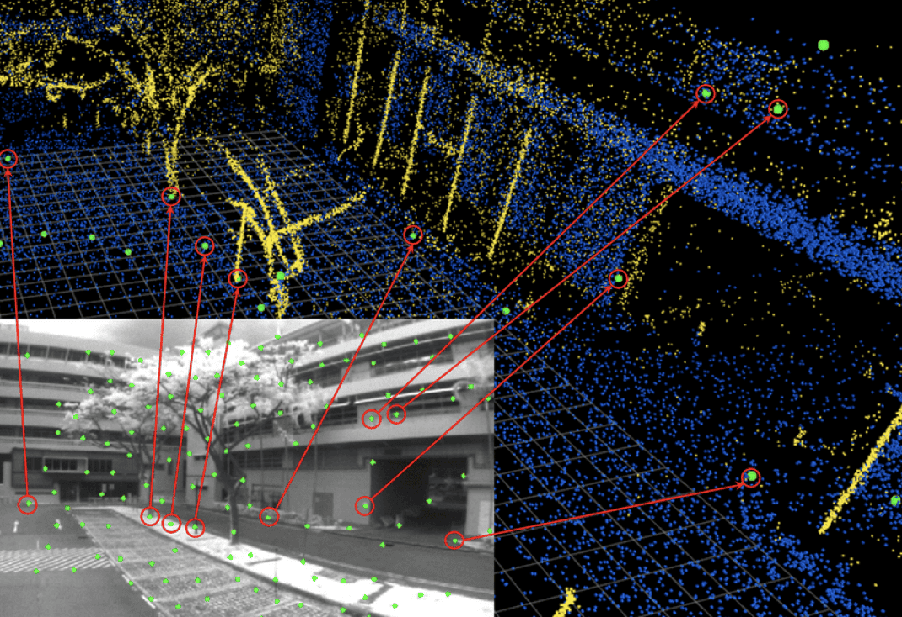

### vSLAM Ergebnis (TUM Dataset)

<video width="100%" controls>
  <source src="images/video.mp4" type="video/mp4">
  Dein Browser unterstützt keine Videos.
</video>

# vSLAM – Use Cases und grundlegende Funktionsweise
vSLAM (Visual Simultanoeus Localization and Mapping) ermöglicht Geräten, mittels Kameras ihre Position in Echtzeit zu bestimmen und Umgebungen
kartographisch abzubilden. Hauptanwendungsbereiche sind autonome mobile Roboter/ Drohnen, Augmented Reality (AR/VR), autonomes Fahren sowie 
Indoor-Navigation (Saugroboter).

Anwendungsbereiche im Detail:

- Robotik und Drohnen: Autonome Staubsauger, Serviceroboter und Drohnen nutzen vSLAM zur Hinderniserkennung, Navigation im Raum und 
  Erstellung von Karten unbekannter Umgebungen/ Räume.

- Augmented & Virtual Reality (AR/VR): vSLAM ist essenziell für Headsets und Smartphones, um die Eigenbewegung präzise zu verfolgen
  und virtuelle Objekte exakt in die reale Welt einzubetten.
   
- Autonomes Fahren: Fahzeuge nutzen visuelle Daten zur Positionsbestimmung auf der Straße und der Kartierung der Umgebung 
  (etwa zum Halten der Spur etc.).

- Indoor-Poitionierung: Anwendung in Innenräumen oder Umgebungen ohne GPS. vSLAM ermöglicht die Navigation in Innenräumen, etwa in 
  Logistikzentren oder für Roboter in Lagerhallen.


# Zentrale Komponenten des VSLAM Algorithmus

Der vSLAM Workflow kann zum besseren Verständnis in drei grundlegende Teile aufgebrochen werden:

- Feature Extraction und visuelle Odometrie

- Lokales Mapping und Optimierung

- Loop Closure und globale Optimierung

## 1.1 Feature Extraction
Das Prinzip von vSLAM basiert auf der Verwendung von Kameras zur Positions- und Objekterkennung im Raum (nicht etwa auf Lasern, vgl. LiDAR).
Die Objekterkennung erfolgt also basierend auf Bildern, aus denen geeignete Algorithmen visuelle Features wie Kanten, Ecken oder Gradienten 
extrahieren. Positionen im Raum von besonderer Signifikanz werden durch Punkte gekennzeichnet und ergeben über die Zeit eine detaillierte 
Punktewolke, die auf der realen Umgebung liegt.

```{=html}
<div style="text-align: center;">
  
  <figcaption>Oben: visual SLAM, Unten: normales SLAM</figcaption>
</div>
```

## 1.2 Visuelle Odometrie
Visuelle Odometrie, da vSLAM Anwendungen stets mit Bewegtbildern arbeiten. Das Verfahren berechnet dabei die Bewegung (zurückgelegte Strecke im Raum)
basierend auf den visuellen Informationen. Im Workflow werden also die erkannten Features (Punkte im Raum) des Ist-Zustandes, mit einer Serie von Bildern
des Pre-Zustandes abgeglichen und somit die Bewegung approximiert. Ein solches Verfahren setzt einen ständigen Abgleich momentaner Bildpunkte mit vorherigen
voraus (Frame to Frame) und nennt sich 'Feature Matching'. Nachdem die falsch gemappten Features identifiziert und abgestoßen wurden, findet die eigentliche Berechnung der 
Bewegung jedes einzelnen Features über die Zeit statt. Informationen über die Tiefe im aufgenommenen Bild spielt als Parameter eine wichtige Rolle und kann
über Stereo-Kameras erreicht werden.

```{=html}
<div style="text-align: center;">
  
  <figcaption>Kamerabewegung mit visueller Odometrie in Echtzeit</figcaption>
</div>
```
Exkurs: Alternative Ansätze zur Bewegungsbestimmung einer Kamera mittels VIO (Visual Inertial Odometry)
TBD

## 2.1 Lokales Mapping
Das lokale Mapping ist der Kern des vSLAM Workflow. Der Output der vorherigen Schritte führt jedoch zu folgender Problematik:
Die erstelle Punktewolke eines Frames ist in drei, die extrahierten visuellen Features allerdings nur in zwei Dimensionen (als Pixel auf dem 
Bildschirm) abgebildet. Ziel des Mappings ist es nun, die 2D Features ihren korrespondierenden Positionen im Raum zuzuordnen. 

```{=html}
<div style="text-align: center;">
  
  <figcaption>Mapping Prozess eines Frames in Action</figcaption>
</div>
```

## 2.2 Lokale Optimierung
Nach abgeschlossenem lokalem Mapping enthält der Ouput theoretisch eine lokale Mini-Map jedes einzelnen Frames, was jedoch
mit signifikanter Fehlerakkumulation einhergeht und die Konsistenz der Karte gefährdet. Ziel der Optimierung ist 
nun die Angleichung aller lokalen Maps, um Frame-to-Frame Konsistenz zu gewährleisten. 
Um Beziehungen zwischen Keyframes zu bestimmen, die dieselben Feature-Punkte enthalten wird ein Konvisibilitätsgraph verwendet, wobei jeder Konten im Graphen 
einen Frame darstellt. Ist eine Mindestanzahl an übereinstimmenden Feature-Punkten detektiert worden, werden die beiden Frame-Knoten mit einer 
Kante verbunden. In einer großen Map wäre es aufgrund komplexem Rechenaufwand ineffizient, alle Kamera-Posen zu optimieren: ein Konvisibilitätsgraph
ermöglicht dabei eine selektive Optimierung zur Fehlerminimierung.

```{=html}
<div style="text-align: center;">
  
  <figcaption>Beispiel eines Konvisibilitätsgraphen</figcaption>
</div>
```

## 3.1 Loop Closure 

## 3.2 Globale Optimierung


## Die Essential Matrix
Wenn wir zwei Bilder derselben Szene aus verschiedenen Winkeln haben, beschreibt die Essential Matrix $E$ die geometrische Beziehung zwischen ihnen:

$$E = [t]_{\times} R$$

Dabei ist:
* $t$ der Translationsvektor (Bewegung).
* $R$ die Rotationsmatrix (Drehung).
* $[t]_{\times}$ die schiefsymmetrische Matrix von $t$.


## Von 2D zu 3D (Triangulation)
Sobald wir die Matrizen kennen, können wir durch Triangulation die Tiefe $Z$ eines Punktes berechnen.

```{python}
#| label: fig-polar
#| fig-cap: "Linienplot im polaren Koordinatensystem"

import numpy as np
import matplotlib.pyplot as plt

r = np.arange(0, 2, 0.01)
theta = 2 * np.pi * r
fig, ax = plt.subplots(
  subplot_kw = {'projection': 'polar'} 
)
ax.plot(theta, r)
ax.set_rticks([0.5, 1, 1.5, 2])
ax.grid(True)
plt.show()
```

## Methodology
You can include complex math like $$E = mc^2$$ and immediately follow it with an interactive 3D figure to visualize your results.

```{=html}

<script src="https://cdn.babylonjs.com/babylon.js"></script>

<div style="width: 100%; height: 400px; position: relative; margin: 20px 0;">
    <canvas id="renderCanvas" style="width: 100%; height: 100%; touch-action: none; border: 1px solid #ddd; display: block; border-radius: 8px;"></canvas>
</div>

<script>
    window.addEventListener('DOMContentLoaded', function() {
        const canvas = document.getElementById("renderCanvas");
        if (!canvas) return;

        const engine = new BABYLON.Engine(canvas, true);

        const createScene = function () {
            const scene = new BABYLON.Scene(engine);
            scene.clearColor = new BABYLON.Color3(0.95, 0.95, 0.95);

            const camera = new BABYLON.ArcRotateCamera("camera", -Math.PI/4, Math.PI/3, 5, BABYLON.Vector3.Zero(), scene);
            camera.attachControl(canvas, true);

            const light = new BABYLON.HemisphericLight("light", new BABYLON.Vector3(0, 1, 0), scene);
            
            const box = BABYLON.MeshBuilder.CreateBox("box", {size: 1.5}, scene);
            const material = new BABYLON.StandardMaterial("mat", scene);
            material.diffuseColor = new BABYLON.Color3(0.1, 0.4, 0.8);
            box.material = material;

            scene.registerBeforeRender(function () {
                box.rotation.y += 0.01;
                box.rotation.x += 0.005;
            });

            return scene;
        };

        const scene = createScene();
        engine.runRenderLoop(() => scene.render());
        window.addEventListener("resize", () => engine.resize());
    });
</script>
```
